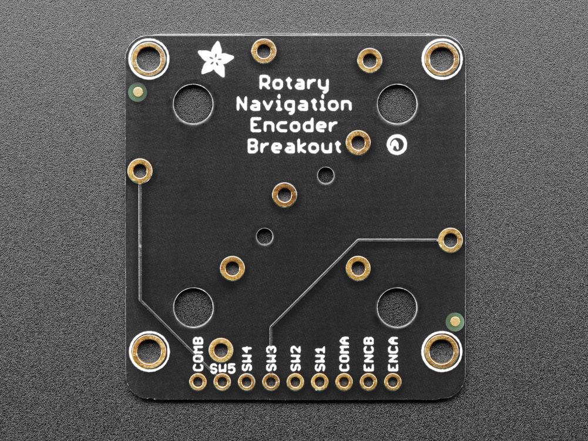

# [ANO Directional Navigation and Scroll Wheel Rotary Encoder and Breakout](https://learn.adafruit.com/ano-rotary-encoder/overview)




**ENCA** — This is the rotary encoder A pin.
**ENCB** — This is the rotary encoder B pin.
**SW1** — This pin is the center button.
**SW2** — This pin is the down button.
**SW3** — This pin is the right button.
**SW4** — This pin is the up button.
**SW5** — This pin is the left button.
**COMA** — Common pin A. Set to ground or VCC - usually ground - so that you can use the microcontroller internal pull-ups for the button/encoders. You can also use a GPIO pin and pull it low.
**COMB** - Common pin B. Set to ground or VCC - usually ground - so that you can use the microcontroller internal pull-ups for the button/encoders. You can also use a GPIO pin and pull it low.


```c++
// SPDX-FileCopyrightText: 2021 Kattni Rembor for Adafruit Industries
//
// SPDX-License-Identifier: MIT

#include <Adafruit_NeoPixel.h>
#include <RotaryEncoder.h>

#define PIN_ENCODER_A 13
#define PIN_ENCODER_B 12
#define COM_A    11
#define COM_B    SDA
#define BUTTON_UP 5
#define BUTTON_LEFT SCL
#define BUTTON_DOWN 9
#define BUTTON_RIGHT 6
#define BUTTON_IN 10

RotaryEncoder encoder(PIN_ENCODER_A, PIN_ENCODER_B, RotaryEncoder::LatchMode::TWO03);
// This interrupt will do our encoder reading/checking!
void checkPosition() {
  encoder.tick(); // just call tick() to check the state.
}
int last_rotary = 0;


#define NUMPIXELS 12
Adafruit_NeoPixel pixels(NUMPIXELS, A0, NEO_GRB + NEO_KHZ800);


void setup(void) {
  Serial.begin(115200);
  while (!Serial);
  Serial.println("ANO Rotary Encoder Demo");

  pinMode(COM_A, OUTPUT);
  digitalWrite(COM_A, LOW);
  pinMode(COM_B, OUTPUT);
  digitalWrite(COM_B, LOW);

  attachInterrupt(digitalPinToInterrupt(PIN_ENCODER_A), checkPosition, CHANGE);
  attachInterrupt(digitalPinToInterrupt(PIN_ENCODER_B), checkPosition, CHANGE);

  pinMode(BUTTON_UP, INPUT_PULLUP);
  pinMode(BUTTON_DOWN, INPUT_PULLUP);
  pinMode(BUTTON_LEFT, INPUT_PULLUP);
  pinMode(BUTTON_RIGHT, INPUT_PULLUP);
  pinMode(BUTTON_IN, INPUT_PULLUP);
  pixels.begin();
  pixels.setBrightness(30);
  pixels.show();
}


void loop(void) {
  // read encoder
  int curr_rotary = encoder.getPosition();
  RotaryEncoder::Direction direction = encoder.getDirection();
  
  pixels.clear();
  if (curr_rotary != last_rotary) {
    Serial.print("Encoder value: ");
    Serial.print(curr_rotary);
    Serial.print(" direction: ");
    Serial.println((int)direction);
  }
  last_rotary = curr_rotary;

  pixels.setPixelColor((curr_rotary + (1000*NUMPIXELS)) % NUMPIXELS, pixels.Color(0, 150, 0));

  if (! digitalRead(BUTTON_UP)) {
    pixels.setPixelColor(0, pixels.Color(150, 0, 0));
  }
  if (! digitalRead(BUTTON_LEFT)) {
    pixels.setPixelColor(NUMPIXELS/4, pixels.Color(150, 0, 0));
  }
  if (! digitalRead(BUTTON_DOWN)) {
    pixels.setPixelColor(NUMPIXELS/2, pixels.Color(150, 0, 0));
  }
  if (! digitalRead(BUTTON_RIGHT)) {
    pixels.setPixelColor(NUMPIXELS*3/4, pixels.Color(150, 0, 0));
  }
  if (! digitalRead(BUTTON_IN)) {
    pixels.fill(pixels.Color(50, 50, 50));
  }
  pixels.show();

  delay(20);
}
```
