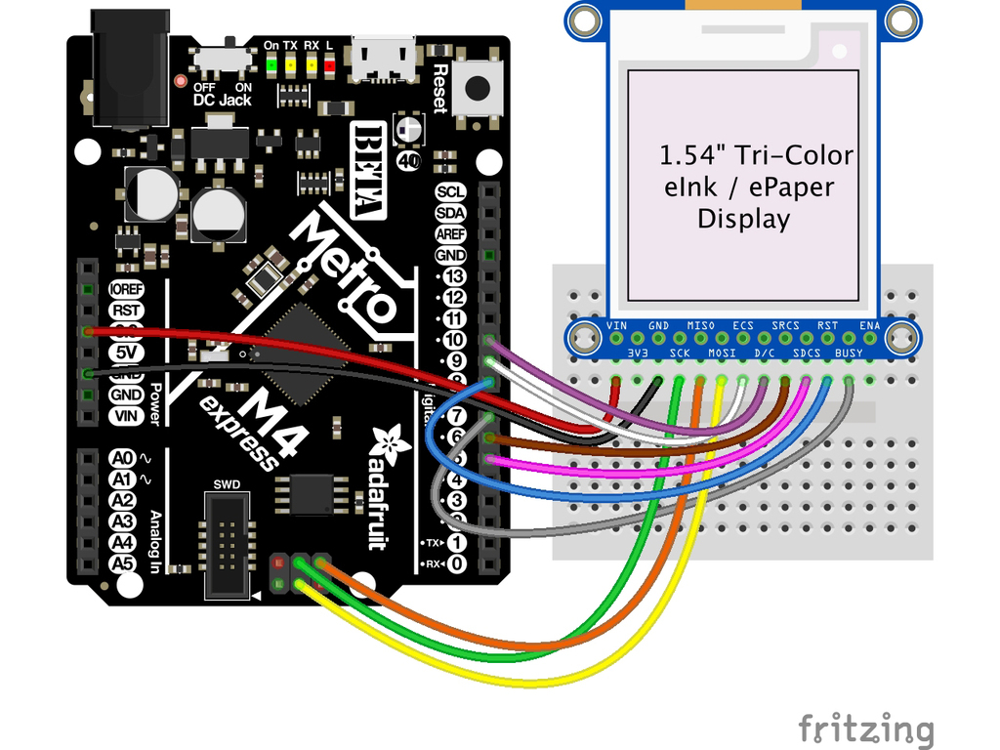
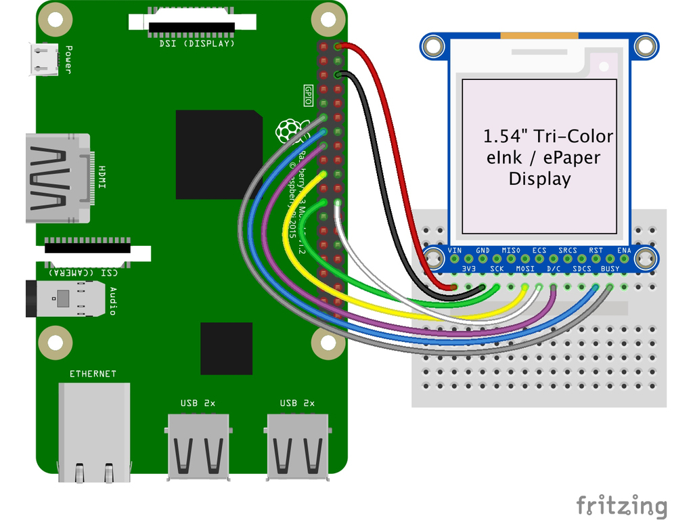

# Wiring

## Mapping
| eInk Pin | Pico Pin Name  | Pico Pin Number       | What I Used |
|----------|----------------|-----------------------|-------------|
| Vin      | VBUS OR 3V3    | 40 OR 36              | PIN38       |
| GND      | GND            | 3,8,13,18,23,28,33,38 | PIN40       |
| CLK      | GPXX-SPI0 SCK  | 4,9,14,19,24          | GP02        |
| MOSI     | GPXX-SPI0 TX   | 5,10,15,20            | GP03        |
| MISO     | GPXX-SPI0 RX   | 1,6,11,16,21          | GP00        |
| ECS      | GPXX-SPI0 CSn  | 2,7,12,17,22          | GP01        |
| D/C      | GPXX           | *                     | GP04        |
| SRCS     | GPXX           | *                     | GP05        |
| SDCS     | -              | -                     | -           |
| RST      | GPXX           | *                     | GP07        |
| BUSY     | GPXX           | *                     | GP10        |
| ENA      | -              | -                     | -           |

## Notes
### Pin Names
**MISO = SPI_RXD**
**MOSI = SPI_TXD**

### Font Sizes
| Size | Width  | Height |
|------|--------|--------|
|  3   |  17.5  |  23.5  |
|  4   |  22.5  |   32   |
|  5   |  27.5  |  37.5  |
|  6   |   35   |  42.5  |
|  7   |   40   |        |

## Resources
[ThinkInk_154_Mono_D67](https://github.com/adafruit/Adafruit_EPD/blob/08571489fbaf89161bb3659531d63f6c58ea10d4/src/panels/ThinkInk_154_Mono_D67.h#L14)
[MbedSPI](https://github.com/arduino/ArduinoCore-mbed/blob/52caeac0926acbfb9a3f2b0fa3ba1c9996f103ec/libraries/SPI/SPI.h#L31)
https://forum.arduino.cc/t/raspberry-pi-pico-ethernet-library-change-spi-pins/916155

---

## Adafruit
https://learn.adafruit.com/adafruit-1-54-eink-display-breakouts/wiring

## Breakout Wiring
Though it looks like a lot of connections, wiring up an eInk breakout is pretty straightforward! Below shows using hardware SPI to connect it to an Adafruit Metro M4.

### Arduino

- **Vin** connects to the microcontroller board's **5V** or **3.3V** power supply pin
- **GND** connects to ground
- **CLK** connects to SPI clock. It's easiest to connect it to pin **3 of the ICSP header**.
- **MOSI** connects to SPI MOSI. It's easiest to connect it to pin **4 of the ICSP header**.
- **MISO** connects to SPI MISO. It's easiest to connect it to pin **1 of the ICSP header**.
- **ECS** connects to our e-Ink Chip Select pin. We'll be using **Digital 9**
- **D/C** connects to our e-Ink data/command select pin. We'll be using **Digital 10.**
- **SRCS** connects to our SRAM Chip Select pin. We'll be using **Digital 6**
- **RST** connects to our e-Ink reset pin. We'll be using **Digital 8.**
- **BUSY** connects to our e-Ink busy pin. We'll be using **Digital 7.**
- **SDCS** connects to our SD Card Chip Select pin. We'll be using **Digital 5**

## Python

- **3.3** to **display VIN**
- **GND** to **display GND**
- **SCLK** to **display SCK**
- **MOSI** to **display MOSI**
- **GPIO CE0** to **display ECS**
- **GPIO 22** to **display D/C**
- **GPIO 27** to **display RST**
- **GPIO 17** to **display BUSY**

