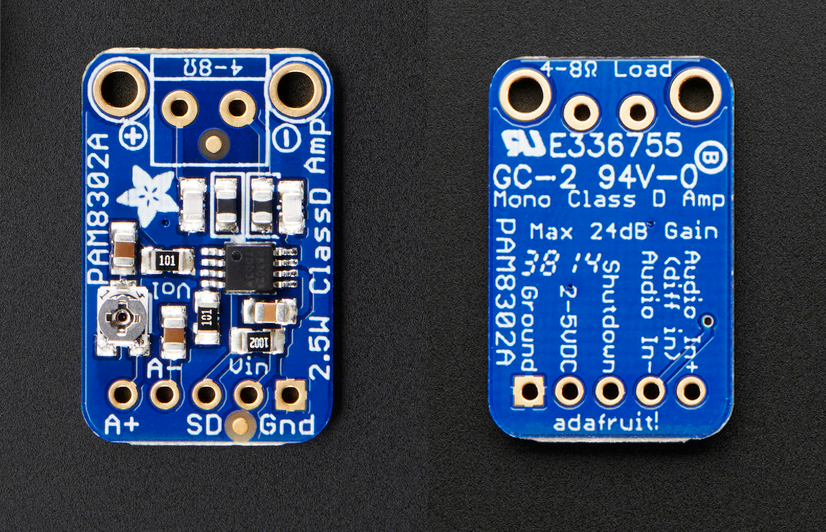

# Pinouts
https://learn.adafruit.com/adafruit-pam8302-mono-2-5w-class-d-audio-amplifier/pinouts

## Power Pins
- **VIN** - This is the power pin. To power the board, give it 2.0V-5.5VDC.
- **GND** - This is common ground for power.

## Input Pins
- **A+** and **A-** - Audio inputs for the amplifier. Signal goes through 1.0uF capacitors, so they are fully 'differential'. If you don't have differential outputs, simply tie the **A-** to ground. 

## Shutdown Pin
- **SD** - The shutdown pin. Can be used to power down the amplifier by tying to ground.

## Output Pins
**+** and **-** - Amplifier output pins. They are spaced to allow for a terminal block to be soldered in place. The output is "Bridge Tied" so that the output connects directly to the speaker pins, no connection to ground.
