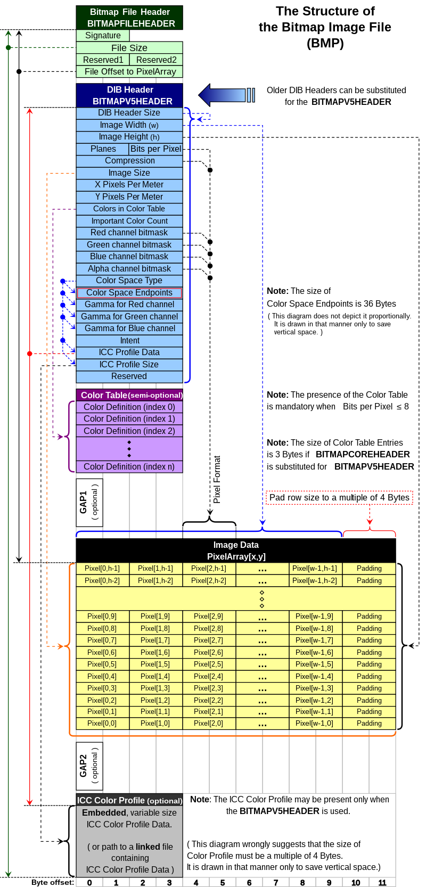

# Creating A Bitmap





## [According To](https://web.archive.org/web/20080912171714/http://www.fortunecity.com/skyscraper/windows/364/bmpffrmt.html)

### The BITMAPFILEHEADER
| start | size | name | stdvalue | purpose |
| --- | --- | --- | --- | --- |
| 1 | 2 | bfType | 19778 | must always be set to 'BM' to declare that this is a .bmp-file. |
| 3 | 4 | bfSize | ?? | specifies the size of the file in bytes. |
| 7 | 2 | bfReserved1 | 0 | must always be set to zero. |
| 9 | 2 | bfReserved2 | 0 | must always be set to zero. |
| 11 | 4 | bfOffBits | 1078 | specifies the offset from the beginning of the file to the bitmap data. |

### The BITMAPINFOHEADER:
| start | size | name | stdvalue | purpose |
| --- | --- | --- | --- | --- |
| 15 | 4 | biSize | 40 | specifies the size of the BITMAPINFOHEADER structure, in bytes. |
| 19 | 4 | biWidth | 100 | specifies the width of the image, in pixels. |
| 23 | 4 | biHeight | 100 | specifies the height of the image, in pixels. |
| 27 | 2 | biPlanes | 1 | specifies the number of planes of the target device, must be set to zero. |
| 29 | 2 | biBitCount | 8 | specifies the number of bits per pixel. |
| 31 | 4 | biCompression | 0 | Specifies the type of compression, usually set to zero (no compression). |
| 35 | 4 | biSizeImage | 0 | specifies the size of the image data, in bytes. If there is no compression, it is valid to set this member to zero. |
| 39 | 4 | biXPelsPerMeter | 0 | specifies the the horizontal pixels per meter on the designated targer device, usually set to zero. |
| 43 | 4 | biYPelsPerMeter | 0 | specifies the the vertical pixels per meter on the designated targer device, usually set to zero. |
| 47 | 4 | biClrUsed | 0 | specifies the number of colors used in the bitmap, if set to zero the number of colors is calculated using the biBitCount member. |
| 51 | 4 | biClrImportant | 0 | specifies the number of color that are 'important' for the bitmap, if set to zero, all colors are important. |


## FROM: https://stackoverflow.com/a/16725027
```c++
// BMP header and pixel format: http://stackoverflow.com/a/2654860
const int width = 16;                   // image width in pixels
const int height = 9;                    // " height

const int imgSize = width*height;
int px[width*height];                        // actual pixel data (grayscale - added programatically below)

// iteratively create pixel data
int increment = 256/(width*height);        // divide color range (0-255) by total # of px
for (int i=0; i<imgSize; i++)
{
	px[i] = i * increment;          // creates a gradient across pixels for testing
}

// set fileSize (used in bmp header)
int rowSize = 4 * ((3*width + 3)/4);      // how many bytes in the row (used to create padding)
int fileSize = 54 + height*rowSize;        // headers (54 bytes) + pixel data

unsigned char *img = (unsigned char *)malloc(3*imgSize);

for (int y=0; y<height; y++)
{
	for (int x=0; x<width; x++)
	{
	  int colorVal = px[y*width + x];                        // classic formula for px listed in line
	  img[(y*width + x)*3+0] = (unsigned char)(colorVal);    // R
	  img[(y*width + x)*3+1] = (unsigned char)(colorVal);    // G
	  img[(y*width + x)*3+2] = (unsigned char)(colorVal);    // B
	  // padding (the 4th byte) will be added later as needed...
	}
}

// create padding (based on the number of pixels in a row
unsigned char bmpPad[rowSize - 3*width];
for (int i=0; i<sizeof(bmpPad); i++)
{
	// fill with 0s
	bmpPad[i] = 0;
}

// create file headers (also taken from StackOverflow example)
unsigned char bmpFileHeader[14] = {            // file header (always starts with BM!)
	'B','M', 0,0,0,0, 0,0, 0,0, 54,0,0,0   };
unsigned char bmpInfoHeader[40] = {            // info about the file (size, etc)
	40,0,0,0, 0,0,0,0, 0,0,0,0, 1,0, 24,0   };

bmpFileHeader[ 2] = (unsigned char)(fileSize      );
bmpFileHeader[ 3] = (unsigned char)(fileSize >>  8);
bmpFileHeader[ 4] = (unsigned char)(fileSize >> 16);
bmpFileHeader[ 5] = (unsigned char)(fileSize >> 24);

bmpInfoHeader[ 4] = (unsigned char)(width      );
bmpInfoHeader[ 5] = (unsigned char)(width >>  8);
bmpInfoHeader[ 6] = (unsigned char)(width >> 16);
bmpInfoHeader[ 7] = (unsigned char)(width >> 24);
bmpInfoHeader[ 8] = (unsigned char)(height);
bmpInfoHeader[ 9] = (unsigned char)(height >>  8);
bmpInfoHeader[10] = (unsigned char)(height >> 16);
bmpInfoHeader[11] = (unsigned char)(height >> 24);

// write the file (thanks forum!)
file.write(bmpFileHeader, sizeof(bmpFileHeader));    // write file header
file.write(bmpInfoHeader, sizeof(bmpInfoHeader));    // " info header

for (int i=0; i<height; i++) {                            // iterate image array
	file.write(img+(width*(height-i-1)*3), 3*width);                // write px data
	file.write(bmpPad, (4-(width*3)%4)%4);                 // and padding as needed
}
```