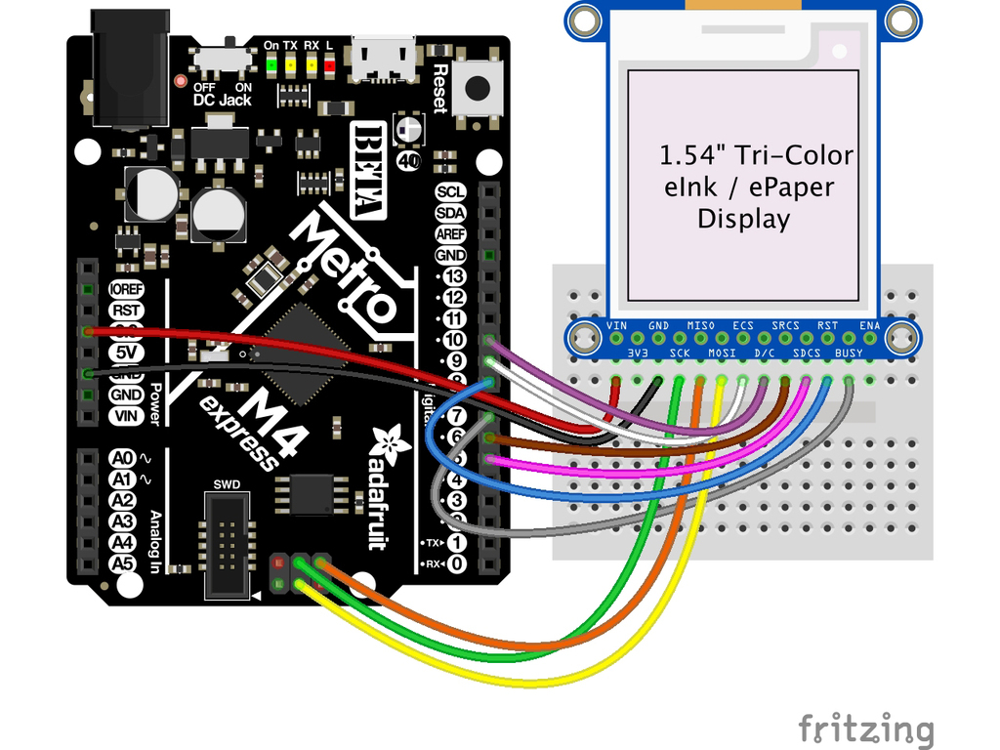
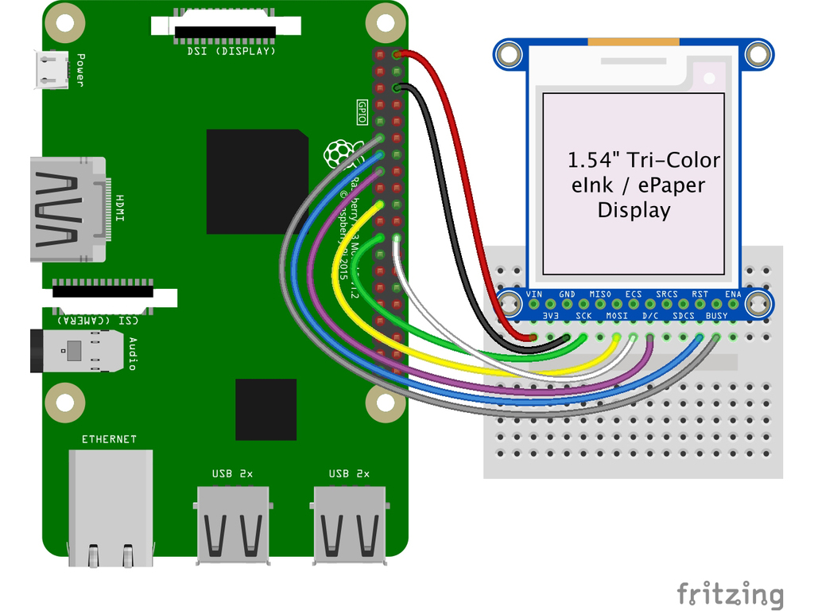

# Wiring
https://learn.adafruit.com/adafruit-1-54-eink-display-breakouts/wiring

## Breakout Wiring
Though it looks like a lot of connections, wiring up an eInk breakout is pretty straightforward! Below shows using hardware SPI to connect it to an Adafruit Metro M4.

### Arduino

- **Vin** connects to the microcontroller board's **5V** or **3.3V** power supply pin
- **GND** connects to ground
- **CLK** connects to SPI clock. It's easiest to connect it to pin **3 of the ICSP header**.
- **MOSI** connects to SPI MOSI. It's easiest to connect it to pin **4 of the ICSP header**.
- **MISO** connects to SPI MISO. It's easiest to connect it to pin **1 of the ICSP header**.
- **ECS** connects to our e-Ink Chip Select pin. We'll be using **Digital 9**
- **D/C** connects to our e-Ink data/command select pin. We'll be using **Digital 10.**
- **SRCS** connects to our SRAM Chip Select pin. We'll be using **Digital 6**
- **RST** connects to our e-Ink reset pin. We'll be using **Digital 8.**
- **BUSY** connects to our e-Ink busy pin. We'll be using **Digital 7.**
- **SDCS** connects to our SD Card Chip Select pin. We'll be using **Digital 5**

## Python

- **3.3** to **display VIN**
- **GND** to **display GND**
- **SCLK** to **display SCK**
- **MOSI** to **display MOSI**
- **GPIO CE0** to **display ECS**
- **GPIO 22** to **display D/C**
- **GPIO 27** to **display RST**
- **GPIO 17** to **display BUSY**

